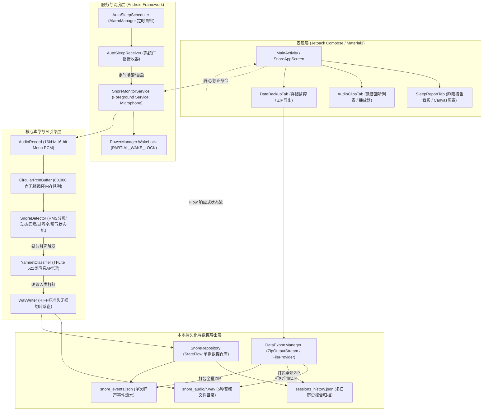

# Snore App (打鼾监测) - 技术架构与开发维护手册 (Technical Manual)

**版本**: v1.2  
**状态**: Active  
**更新日期**: 2026-10-01  
**技术栈**: Android Jetpack, Kotlin Coroutines, Jetpack Compose, Material3, TensorFlow Lite, AlarmManager

---

## 1. 系统总体架构 (System Architecture)

Snore App 采用**分层解耦的 Local-First 响应式架构**。整个应用由声学引擎层、后台服务与调度层、本地持久化与归档层、以及 Compose 表现层构成：



---

## 2. 核心声学引擎详细设计 (Audio Pipeline)

### 2.1 音频采集 (`AudioRecord`)
* **采样配置**：`SampleRate = 16000Hz`, `AudioFormat.CHANNEL_IN_MONO`, `AudioFormat.ENCODING_PCM_16BIT`。
* **分帧处理**：帧长 `frameSize = 1600` 个采样点（即每帧恰好对应 **100 毫秒** 音频），缓冲区大小 `bufferSize = maxOf(minBufferSize, frameSize * 4)`。
* **常驻内存极小**：每 100 毫秒循环复用同一个 `ShortArray(1600)`，内存占用仅 3.2 KB，零 GC 开销。

### 2.2 循环内存缓冲区 (`CircularPcmBuffer.kt`)
* **容量**：80,000 个 `Short`，对应恰好 **5.0 秒** 的原始音频。
* **算法**：采用环形指针数组（Ring Buffer），提供 `write(data, length)` 与 `getRecentSamples(count)`。
* **零磁盘磨损**：在没有检测到打鼾时，音频一直在内存环形队列中覆盖滑动，不产生任何闪存写操作。

### 2.3 信号检测与呼吸暂停状态机 (`SnoreDetector.kt`)
1. **均方根（RMS）与分贝映射**：
   $$\text{RMS} = \sqrt{\frac{1}{N}\sum_{i=1}^{N} x[i]^2}$$
   $$\text{dB} = 20 \log_{10}(\text{RMS} + 1)$$
2. **自适应环境底噪跟踪**：
   * 采用滑动一阶低通滤波跟踪环境噪音底线：
     $$\text{noiseFloor} = \text{noiseFloor} \times 0.95 + \text{currentDb} \times 0.05$$
   * 触发有效声学事件的动态阈值为 $\max(\text{noiseFloor} + 12\text{dB}, 42\text{dB})$。
3. **过零率（ZCR）校验**：
   * 过滤高频啸叫与过高频率的声音，确保只对人体气道振动频率敏感。
4. **疑似呼吸暂停（Apnea）检测算法**：
   * 状态机维护 `lastSnoreEndTime` 与 `silenceGapDuration`；
   * 若打鼾事件之后出现 **12 秒 ～ 60 秒的完全静音空档**，且随后的第一声鼾声强度超过 55dB（剧烈代偿性喘气复苏），则触发 `isApneaSuspect = true`。

### 2.4 YAMNet AI 模型本地推理 (`YamnetClassifier.kt`)
* **模型集成**：使用 Google 官方的 `yamnet.tflite`（位于 `app/src/main/assets/yamnet.tflite`，仅 4.1MB）。
* **输入张量**：`1 x 15600` 浮点数数组（对应 0.975 秒 16kHz PCM 音频，归一化到 $[-1.0, 1.0]$）。
* **干扰类别过滤**：
  * 包含 521 个声音类别的预测概率；
  * 如果预测置信度最高的前 3 项中包含 `Aircraft`, `Jet engine`, `Vehicle`, `Speech` 且高于打鼾分类，系统将判定为环境噪声，直接丢弃，不计入打鼾指标。

---

## 3. 调度与后台保活架构 (Scheduling & Background Resilience)

### 3.1 前台服务与 Android 14 规范 (`SnoreMonitorService.kt`)
* **声明规范**：`AndroidManifest.xml` 中声明 `android:foregroundServiceType="microphone"`。
* **系统唤醒锁**：
  ```kotlin
  wakeLock = powerManager.newWakeLock(PowerManager.PARTIAL_WAKE_LOCK, "SnoreApp:MonitorWakeLock")
  wakeLock?.acquire()
  ```
  在熄屏后维持 CPU 低频低功耗运转，屏幕完全保持黑屏。

### 3.2 智能夜间区间与自检循环 (`AutoSleepScheduler.kt` & `AutoSleepReceiver.kt`)
* **夜间作息判定算法** (`AppSettings.isInNightWindow()`)：
  * 支持跨午夜时间计算（例如 22:30 ~ 07:30，分钟数 $\ge 1350$ 或 $\le 450$）。
* **区间内强行拉起机制**：
  * 处于区间内时，无脑调用 `SnoreMonitorService.start(context)`；
  * 若被 Android 14 后台限制拦截，降级触发带动作意图的锁屏卡片通知（`PROMPT_NOTIFICATION_ID = 2002`）：
    ```kotlin
    .addAction(android.R.drawable.ic_media_play, "▶ 立即开启监测", startServicePendingIntent)
    ```
* **动态巡检闹钟** (`ACTION_RETRY_CHECK`)：
  * 若用户在设定时间仍在亮屏玩手机，系统每 15 分钟触发一次精确闹钟（`AlarmManager.setExactAndAllowWhileIdle`），在睡眠区间内持续尝试拉起，直到监测开始或超出作息时间。

---

## 4. 本地持久化与全量导出架构 (Data Persistence & Export)

### 4.1 多日历史归档 (`SnoreRepository.kt`)
* **文件存储划分**：
  * `sessions_history.json`：全量多日睡眠历史汇总数组，包含每日监测时长、分贝值、评级及每小时分布。
  * `last_session.json`：昨夜单次快速缓存。
  * `snore_events.json`：全部打鼾事件明细（时间戳、分贝峰值、对应音频路径）。
  * `snore_audio/*.wav`：5 秒无损 WAV 原声切片。
* **响应式状态流**：
  * `storageUsageFlow: StateFlow<StorageUsage>`：实时推送机身已占用的总字节数、音频字节数、报告字节数。
  * `sessionsHistoryFlow: StateFlow<List<SleepSession>>`：历史多日会话流。

### 4.2 一键全量打包与分享 (`DataExportManager.kt`)
* **导出组织结构**：
  ```text
  SnoreApp_Backup_20261001_080000.zip
  ├── sleep_sessions.csv    # 每日汇总指标（适合 Excel/Pandas）
  ├── sleep_sessions.json   # 完整结构化原始数据（包含 24 小时直方图）
  ├── snore_events.csv      # 单次打鼾事件流水账
  ├── README.txt            # 数据字典与医学阈值说明
  └── audio/                # 全部 5 秒 WAV 录音切片
      ├── snore_1727710200.wav
      └── snore_1727710800.wav
  ```
* **系统级安全共享**：
  * 通过 `androidx.core.content.FileProvider` 映射 `res/xml/file_paths.xml`；
  * 使用 `Intent.ACTION_SEND` 调起原生分享面板，支持免连线将 ZIP 传到 PC。

---

## 5. 本地轻量化工具链与 CI/CD 维护

本项目坚持**“零重度依赖（免安装几 GB 的 Android Studio）”**原则：

### 5.1 本地编译指令
* **依赖环境**：
  * JDK 21：预装于 `C:\Program Files\JetBrains\JetBrains Rider 2025.3.3\jbr`
  * Android SDK：独立绿色便携包位于 `D:\Programming\android\sdk`
* **秒级编译**：
  在项目根目录下双击或命令行运行：
  ```bat
  .\build.bat
  ```
  在 3~4 秒内即可输出 `app\build\outputs\apk\debug\app-debug.apk`。

### 5.2 远程自动化构建 (GitHub Actions)
* **工作流文件**：`.github/workflows/build-apk.yml`
* **触发机制**：每次向 `main` 分支执行 `git push`，GitHub Actions 自动启动 Ubuntu Runner，拉取最新代码并编译打包，生成名为 `SnoreApp-debug` 的 APK 供随时下载。
