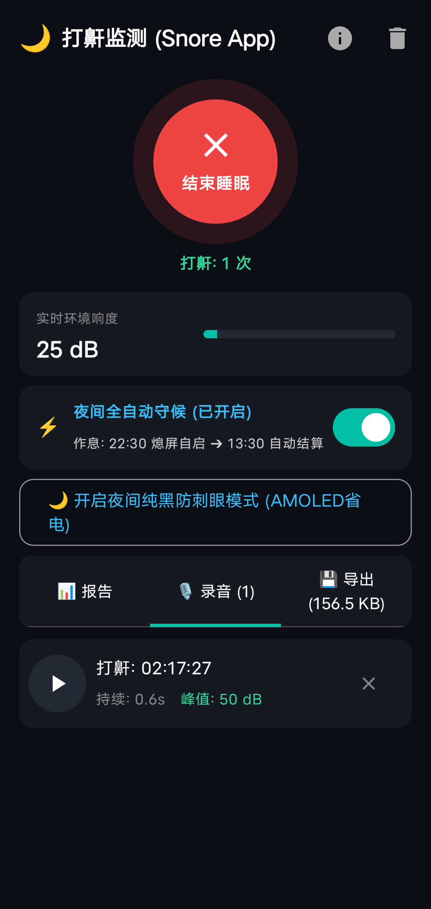
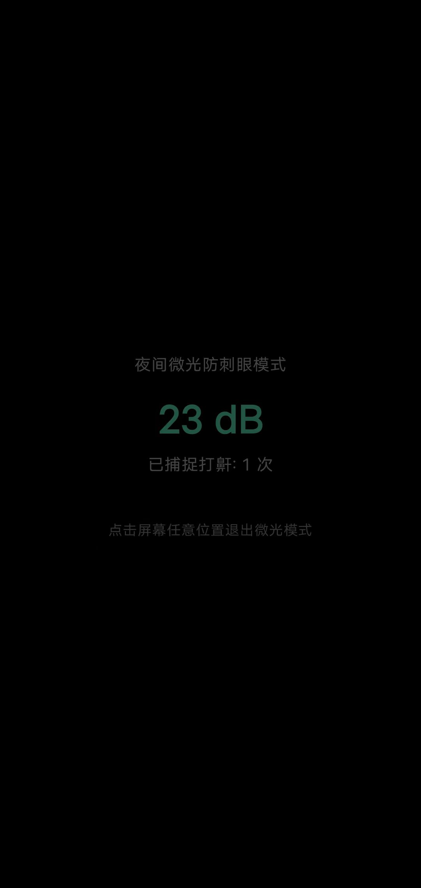

# Snore App (打鼾监测) - 用户使用手册 (User Manual)

**版本**: v1.2  
**适用平台**: Android 8.0 及以上系统  
**更新日期**: 2026-10-01  

---

## 欢迎使用 Snore App

**Snore App** 是一款专为个人打造的**轻量、极简、无广告、纯离线**的打鼾与睡眠呼吸健康监测工具。

* 🔒 **100% 本地隐私安全**：没有任何网络请求，没有账号注册，录音与睡眠数据永不出手机；
* ⚡ **极度省电低发热**：整夜（8小时）熄屏监测耗电仅 **5% ~ 8%**，不插电也能安心使用；
* 🧠 **AI 本地降噪**：内置离线声音识别 AI，自动过滤飞机轰鸣、车流噪声与说话声，只记录真实打鼾；
* 💾 **数据自主沉淀**：从安装日起永久保存历史记录，随时一键导出为标准 CSV/WAV 压缩包导入电脑分析。

---

## 一、初次安装与必要授权

为了确保应用能在整夜熄屏、锁屏状态下稳定守护你的睡眠，初次打开请完成以下两步配置：

### 1. 允许核心系统权限
首次打开 App 时，系统会弹出权限请求：
* **麦克风权限（录音权限）**：必须选择 **“使用时允许”**（用于夜间捕捉呼吸与打鼾声）；
* **通知权限**：必须选择 **“允许”**（Android 13/14 必需，用于后台常驻监测以及作息时间到达时的快速启动卡片）。

> **注意**：如果安装时未弹窗，可以在手机的 `设置 -> 应用管理 -> Snore App -> 权限管理` 中手动开启麦克风与通知权限。

### 2. 开启“忽略电池优化”（防系统杀后台）
很多安卓手机在熄屏一两个小时后会强行杀掉后台应用。
1. 点击 App 首页右上角的 **`ℹ️` (信息图标)**；
2. 手机会弹出系统设置，选择 **“允许 / 不受限制 / 忽略电池优化”**，保证整夜运行不断流。

---

## 二、日常使用指南（两种使用模式）

### 模式一：【夜间全自动守候】（最省心，强烈推荐 ⭐⭐⭐）
你不需要每天睡前手动点击开启，App 会在后台全自动工作：

1. **设置个人作息**：
   * 在首页点击 **“⚡ 夜间全自动守候”** 卡片；
   * 在弹出的对话框中设置你的日常作息：
     * **入睡时间点**（如 `22:30`）
     * **起床时间点**（如 `07:30`）
   * 点击“确定保存”；
2. **日常无感使用**：
   * 每天到了晚上 22:30，App 会自动在后台开启监测；
   * 若你正在玩手机，锁屏后系统会自动接管开始监测；若系统有所限制，锁屏界面会常驻 **`[▶ 立即开启监测]`** 快捷通知，轻轻一点即刻秒启；
   * 早上到了 07:30，App 会自动停止录音并收尾，生成整夜完整报告。

---

### 模式二：【手动一键开启与结束】
如果你偶尔午休，或者睡眠作息不规律：

1. **开始入睡**：
   * 睡前打开 App，点击屏幕中间巨大的青色圆球 **“开始入睡”**；
   * 按钮变为红色呼吸脉冲状态，实时分贝指示计开始跳动，即可将手机锁屏放在床头柜上；
2. **结束睡眠**：
   * 晨起打开手机，点击红色的 **“结束睡眠”** 按钮；
   * 监测立即停止，并瞬间生成昨夜完整的睡眠分析报表。

  
   
  <b>图 1：主监测运行界面与打鼾录音切片列表</b>

---

### 实用技巧：【🌙 开启夜间纯黑防刺眼模式】
在监测运行中，界面会出现一个按钮 **“🌙 开启夜间纯黑防刺眼模式”**：
* 点击后，整个手机屏幕变为**极致纯黑（#000000）微光模式**；
* 夜间半夜醒来看手机完全不刺眼，且在 OLED 屏幕上屏幕耗电为 0；
* 随时轻触屏幕任意位置即可退回主界面。

  
   
  <b>图 2：夜间微光防刺眼模式（AMOLED 纯黑 0 功耗）</b>

---

## 三、如何看懂你的睡眠健康报告？

在 **「📊 报告」** 分页，每次睡眠结束后会自动生成 5 大维度的专业图表：

| 指标项 | 含义与健康参考范围 |
| :--- | :--- |
| **睡眠呼吸综合评级** | • **轻微安眠**（绿色）：打鼾占比低于 5%，整夜呼吸顺畅； • **中度打鼾**（黄色）：打鼾占比 5%~15%，存在间歇性鼾声； • **重度需关注**（红色）：打鼾占比超过 15%，或出现多次呼吸屏气暂停。 |
| **疑似屏气暂停 (Apnea)** | **⚠️ 重点关注**：记录打鼾过程中出现 **12 秒 ～ 60 秒的完全无声窒息**，且随后紧接着剧烈大喘气的次数。若频次较多，建议关注是否存在睡眠呼吸暂停综合征（OSA）。 |
| **打鼾负担占比 (%)** | 累计打鼾时长占整夜总监测时间的百分比。占比越低代表睡眠质量越高。 |
| **最高分贝与平均响度** | • **< 48 dB（轻鼾）**：像轻微的微风拂叶，不影响伴侣； • **48 ~ 60 dB（中鼾）**：普通交谈声，可能影响同床人； • **> 60 dB（重鼾）**：相当于嘈杂闹市或大声喧哗，建议关注呼吸道通畅度。 |
| **整夜时间轴分布图** | Compose Canvas 绘制的 24 小时柱状分布图，直观展现你在凌晨几点打鼾最频繁、几点进入深度平静睡眠。 |

---

## 四、录音回听与管理

在 **「🎙️ 录音」** 分页中：
1. **真实鼾声切片**：App 不会保存长达几小时的空白录音，只截取每一次打鼾发生时的 **5 秒钟标准 WAV 真实切片**；
2. **原声播放**：点击任意一条记录，可直接原地播放该段录音，听听自己昨晚打鼾的真实声音和响度；
3. **单条清理**：点击记录右侧的小叉号，可以随时删除不想要的单条录音。

---

## 五、数据沉淀、占用空间查看与一键全量导出

在 **「💾 导出」** 分页中：

### 1. 实时查看占用的机身存储
界面会清晰显示自安装以来的全部数据：
* **累计监测天数** 与 **捕获鼾声总数**；
* **本地总占用空间**（格式化显示为几百 MB 或几 GB）；
* 明确区分 **🎙️ 音频文件** 占了多少、**📊 历史指标报告** 占了多少。

### 2. 📦 一键导出全量数据包到电脑
当你记录了几个月或一年，想把数据拿到电脑用 Excel、Python 或专业软件做更深度的大数据分析：
1. 点击 **`[ 📦 一键打包导出全量数据包 (.zip) ]`**；
2. 系统会自动在后台打包生成 `SnoreApp_Backup_日期.zip`；
3. 弹出安卓系统原生分享菜单，你可以直接：
   * 发送给微信 **“文件传输助手”**；
   * 通过手机自带的 **“系统互传 / 快传”** 直接无线推到电脑；
   * 保存到坚果云、网盘或手机本地的“下载”文件夹。

### 3. 解压后的 ZIP 包里有什么？
* **`sleep_sessions.csv`**：所有历史天数的标准数据表，在电脑上双击就能用 **Excel** 打开画折线图；
* **`sleep_sessions.json`**：包含每小时打鼾分布数组的结构化数据，适合 Python / Pandas 二次分析；
* **`snore_events.csv`**：记录每一声打鼾的精确时间戳、峰值分贝和关联文件名；
* **`audio/ 文件夹`**：所有的 5 秒 16kHz WAV 原始音频文件，能在任何播放器中直接播放。

### 4. 🗑️ 贴心的“无损瘦身”空间释放
当你把几个 G 的数据导出到了电脑后，手机空间可能有点紧张：
* 点击 **`[ 🗑️ 仅清理历史录音 (保留全部图表指标) ]`**；
* 系统会清空手机上的 WAV 音频文件（瞬间释放几 GB 空间）；
* **但是，所有历史睡眠报告、趋势图、评分和曲线依然永远完整保留在手机上！**

---

## 六、常见问题与排查 (FAQ)

### Q1: 到点后为什么没有自动开启监测？
* **检查权限**：确保已在手机权限设置中授予了 **麦克风权限** 与 **通知权限**；
* **检查锁屏通知**：在某些 Android 14 极其严格的手机上，系统禁止后台静默开麦克风。到点后手机锁屏上会出现一条 **“🌙 夜间打鼾监测已就绪”** 的高优先级通知，点击上面的 **`[▶ 立即开启监测]`** 即可直接启动。

### Q2: 这个软件真的不会泄露我的录音隐私吗？
* **100% 绝对安全**。可以在 `AndroidManifest.xml` 中查验：应用**连“访问互联网（INTERNET）”的权限都没有申请**，手机物理上没有任何代码能够将你的声音上传到外网。

### Q3: 晚上不插电可以使用吗？会不会把手机耗光？
* 完全可以不插电使用。在主流 5000mAh 电池手机上，整夜 8 小时熄屏监测的耗电量仅为 **5% ~ 8% 左右**（平均一小时不到 1%），早晨醒来手机依然电量充足。
